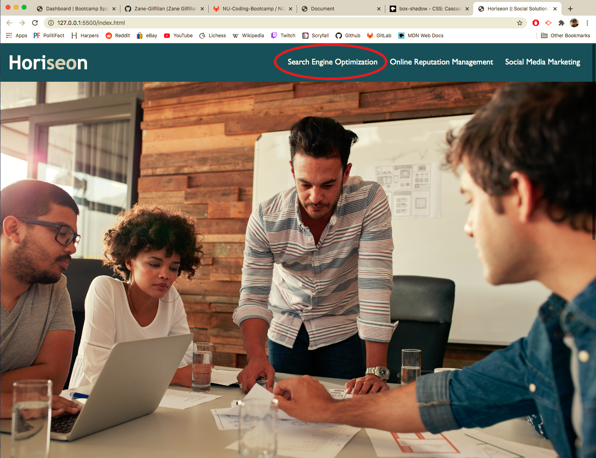
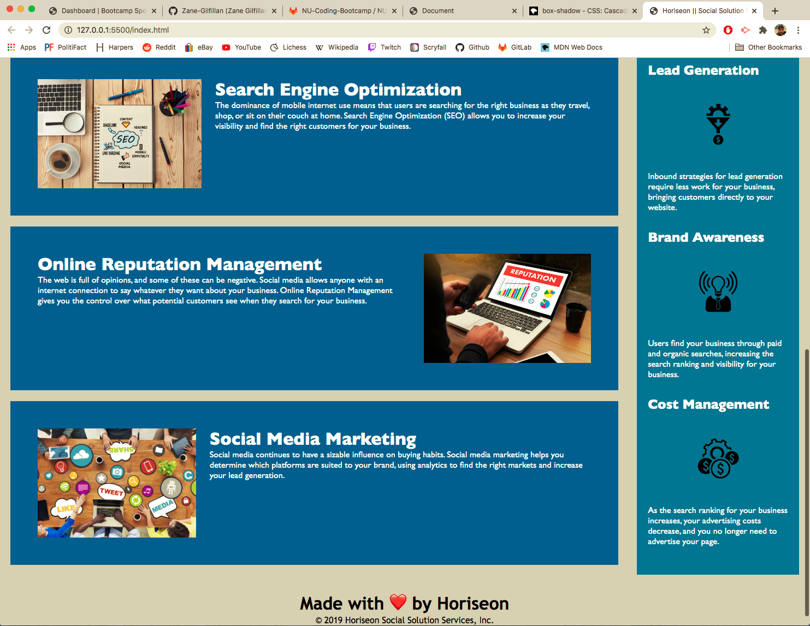

# Accessibility Update 

as seen below (highlighted in red) we originally had a broken link that took us no where. it has now been fixed.

we also brought the main showcase photo from being a css item:
```
.hero img {
    background-image: url("images/digital-marketing-meeting.jpg);
    background-size: cover;
    background-position: center;
}    
```
into an html tag:
```
<div class="hero">
         
    </div> 
```
moving that image into our html file changed the size of the photo to have more focus on it and gives more meaning to our link tags in our header.

prior to the change, our content seciton was visible at the bottom of the screen on the page load, which would lead users to scroll down the page in order to interact with them.

with our new changes the user will be directed to our links up top and will be more likely to interact with them.

the screen shots provided below demonstrate what the user will see (sans the red highlight) when they access this page and that our 'content' and 'benefits' section are not visible right away. this once again will lead our users to interact with the links we fixed in our header. 




more orginizational changes were made to the html and css files as well.

in our html files accessibility was the focus by updating all of our images to include alt tags:

```

```
css files were also organized. instead of calling repeating code to similar classes, I compiled them as seen below:

```
.benefits h3 {
    margin-bottom: 10px;
    text-align: center;
}
```

the same was done for all ```img``` and ```div``` elements within their corresponding classes. 


<strong>finished product:</strong> https://zane-gilfillan.github.io/Horiseon-Accessibility-Update/


